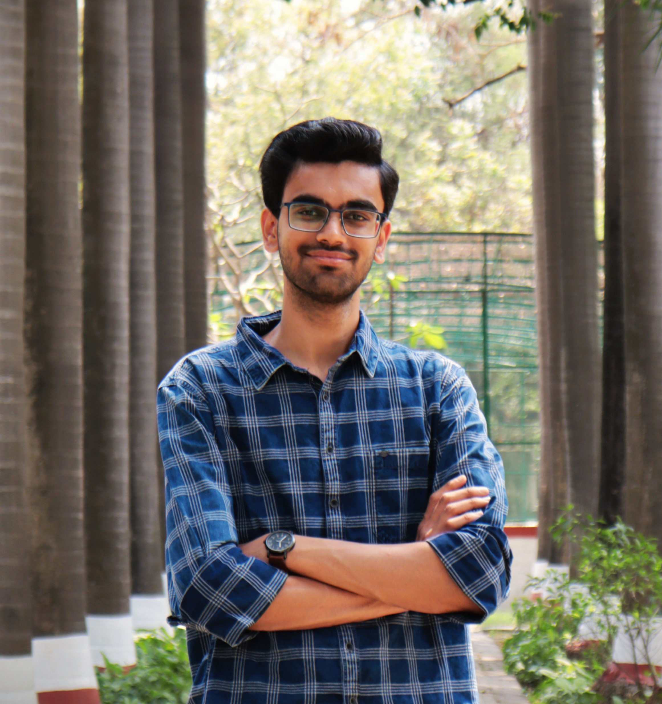

.. _aboutme:

About Me
========

*“Engineering taught me logic. Filmmaking taught me emotion. I try to balance both in everything I create.”*

Hi there - I’m **Harshit Mishra**, an Electronics & Communication engineer and a Filmmaker. 

- My filmmaking journey began in 2016 as a side passion: I grabbed a mobile phone, shot my first short, and discovered the magic of moving images. Since then, I’ve created multiple YouTube channels - writing scripts, directing actors, and learning every aspect of post‑production from color grading to sound design.

- Today, I wear many hats. On YouTube, I produce original content: from behind‑the‑scenes tutorials to cinematic mini‑dramas. I write screenplays, design camera setups, and handle all aspects of editing in Davinci Resolve, Premiere Pro and After Effects. My passion for technical precision carries over into every frame I craft.

- Being a content creator helped me at `Upside Down Labs <https://upsidedownlabs.tech/>`_ , venture I am currently working at to use the creative expertise to lead video storytelling and content strategy to planning campaigns, shooting product demos, and editing polished brand stories. 

- With a background in **Electronics & Communication Engineering from BIT Mesra**, I bring both the precision of an engineer and the intuition of a filmmaker to every project - whether I’m designing a circuits or storyboarding a short film.
  
What I Bring
------------

- **End‑to‑end video production:** Scripting, storyboarding, lighting, on‑location direction, and post‑production in DaVinci Resolve, Premiere Pro, and After Effects.  
- **Content strategy & community growth:** As Social Media Head for BIT Mesra’s cultural committee (Vibrations, Republic Day Fest), I designed campaigns that doubled our online engagement.  
- **Event photography & coordination:** Captured 20 + campus events for LENSOC and the Institute of Plasma Research, growing club membership by 30 % and earning “Best Management” honors.  
- **Creative ideation & leadership:** From producing school theatre scripts to managing full‑stack content calendars, I thrive on turning ideas into polished deliverables under tight deadlines.  

Let’s Connect
-------------

I blend technical precision with cinematic intuition - whether it’s automating a camera rig or crafting a visual narrative. Feel free to explore my :ref:`Gallery page<gallery>` or reach out on the :ref:`Contact page<contact>`; I’d love to collaborate on your next creative or technical project!  

.. toctree::
   :maxdepth: 1
   :hidden: